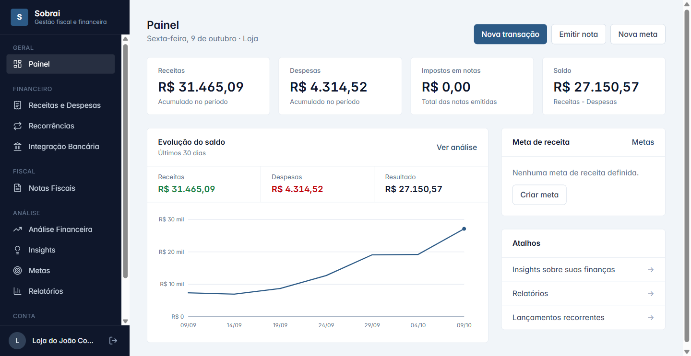
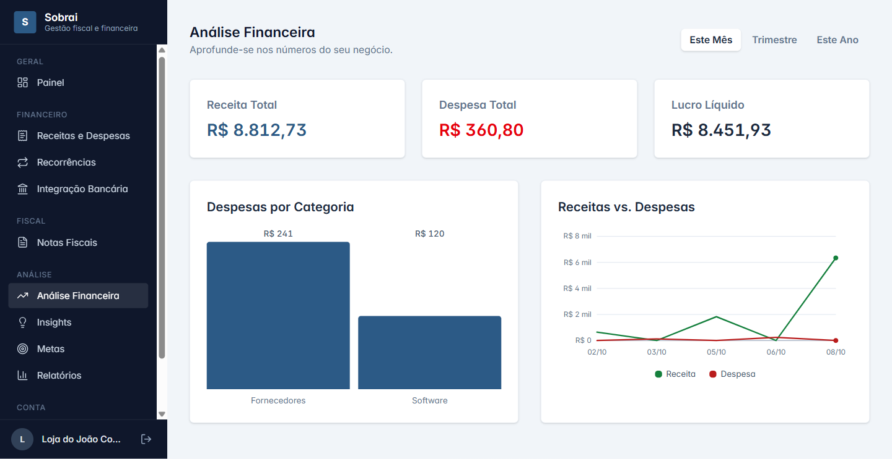
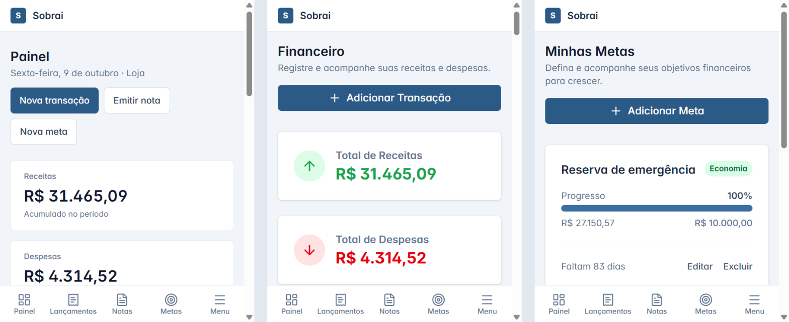

<div align="center">

<br>

# 🧾 Sobrai

### Gestão fiscal e financeira para MEI, autônomos e pequenos negócios

Controle receitas e despesas, **emita notas fiscais** e acompanhe quanto sobrou depois dos impostos, tudo num só lugar e do celular.

<br>


[**Back-end da API →**](https://github.com/joaofelipex/sobrai-back)

<br>



</div>

<br>

## 📑 Sumário

[Por que existe](#-por-que-existe) · [Funcionalidades](#-funcionalidades) · [Telas](#-telas) · [Destaques técnicos](#-destaques-técnicos) · [Como rodar](#-como-rodar) · [Estrutura](#-estrutura) · [Limitações](#-limitações-conhecidas) · [Roadmap](#-roadmap)

<br>

## 💡 Por que existe

Quem é MEI ou trabalha por conta própria costuma controlar o dinheiro numa planilha, emitir a nota no portal da prefeitura e só descobrir o imposto na hora de pagar. O Sobrai junta as três tarefas: **registra** receitas e despesas, **emite** a nota de serviço e mostra, a qualquer momento, **quanto sobrou**.

<br>

## ✨ Funcionalidades

| | Área | O que faz |
|:-:|---|---|
| 📊 | **Painel** | Receitas, despesas, saldo e impostos em notas; evolução do saldo em 30 dias; progresso da meta de receita |
| 💸 | **Receitas e despesas** | CRUD completo com categorias, filtros e totais |
| 🔁 | **Recorrências** | Lançamentos mensais (aluguel, assinaturas) gerados no vencimento, inclusive os meses em atraso |
| 🧾 | **Notas fiscais** | Emissão com cálculo de imposto conforme o enquadramento (MEI, Simples, autônomo) e receita criada automaticamente |
| 🏛️ | **NFS-e Nacional** | Geração e assinatura da DPS, envio à SEFIN, download do XML e cancelamento |
| 🎯 | **Metas** | Metas de faturamento ou economia, com progresso e prazo |
| 📈 | **Análise e relatórios** | Receitas vs. despesas por período, despesas por categoria, lucro líquido |
| 💡 | **Insights** | Recomendações com Google Gemini, chamadas pelo servidor (opcional) |

<br>

## 🖼️ Telas

<div align="center">

<br><sub>Análise financeira: gráficos feitos à mão em SVG e CSS, sem biblioteca</sub>
<br><br>

<br><sub>Celular: barra de navegação inferior, cartões no lugar de tabelas, alvos de toque de 44px</sub>
</div>

<br>

## 🛠️ Destaques técnicos

<table>
<tr>
<td width="50%" valign="top">

**🅰️ Angular moderno**
- Componentes *standalone*, **signals** e `OnPush`
- Estado em serviços reativos com `computed`
- Gráficos de linha e barra próprios: eixo de valores, saldo negativo e rótulos que se ajustam à largura

</td>
<td width="50%" valign="top">

**📱 Mobile first de verdade**
- Barra inferior no celular e gaveta de menu
- Tabelas viram cartões abaixo de 1024px
- Campos de 16px (sem zoom no iOS) e áreas seguras do aparelho

</td>
</tr>
<tr>
<td valign="top">

**🎨 Design system enxuto**
- Tailwind CSS 4 **compilado no build** (sem CDN)
- Tema próprio, tipografia Inter e números tabulares
- Visual sóbrio de software contábil, sem enfeite

</td>
<td valign="top">

**🏛️ NFS-e Nacional**
- XML validado contra os XSDs oficiais
- Certificado A1 guardado criptografado no servidor
- Homologação por padrão; emissão sem duplicidade

Detalhes no [repositório da API](https://github.com/joaofelipex/sobrai-back).

</td>
</tr>
</table>

<br>

## 🚀 Como rodar

> **Pré-requisitos:** Node.js 20.12 ou superior e a [API do Sobrai](https://github.com/joaofelipex/sobrai-back) rodando na porta 3001.

```bash
# 1. API (em outro terminal)
git clone https://github.com/joaofelipex/sobrai-back.git
cd sobrai-back && npm install && npm run dev

# 2. Front-end
git clone https://github.com/joaofelipex/sobrai-front.git
cd sobrai-front
npm install
npm run dev
```

Abra **http://localhost:3000**. Na primeira vez, o onboarding pergunta o nome e o enquadramento da empresa.

<details>
<summary><b>📱 Abrir no celular</b></summary>

<br>

Com o celular no mesmo Wi-Fi do computador, acesse `http://<IP-do-seu-PC>:3000`. O front descobre sozinho o endereço da API (mesmo IP, porta 3001), então não precisa configurar nada. Se não abrir, libere as portas 3000 e 3001 no firewall do Windows.

</details>

<details>
<summary><b>🧪 Dados de exemplo</b></summary>

<br>

Na pasta da API, `node seed.js` cria clientes, transações e metas de exemplo sem apagar nada que já exista.

</details>

<br>

## 🗂️ Estrutura

```
src/
├── components/
│   ├── dashboard/        # painel
│   ├── pages/            # receitas, notas, metas, análise, relatórios, configurações…
│   ├── sidebar/          # menu lateral (gaveta no celular)
│   ├── bottom-nav/       # barra de navegação inferior (celular)
│   └── shared/           # gráficos, cartões, toasts, spinners
├── services/             # estado com signals + chamadas à API
├── models/               # tipos do domínio
└── environments/
```

<br>

## ⚠️ Limitações conhecidas

- **Sem autenticação:** hoje é um app de uma única empresa.
- **Integração bancária e assinatura são simuladas** (interface pronta, sem provedor real).
- A NFS-e foi testada de ponta a ponta contra uma SEFIN simulada, **ainda não contra o ambiente real de homologação**, que exige certificado ICP-Brasil.
- Testado em larguras de 390px e 768px por emulação, não em aparelhos físicos.

<br>

## 🗺️ Roadmap

- [ ] Autenticação e múltiplas empresas
- [ ] Validar a NFS-e no ambiente real de homologação
- [ ] Importação de extratos (OFX) e conciliação
- [ ] Apuração do DAS do MEI com lembrete de vencimento
- [ ] Deploy com Docker

<br>

<div align="center">

Feito por [@joaofelipex](https://github.com/joaofelipex)

</div>
